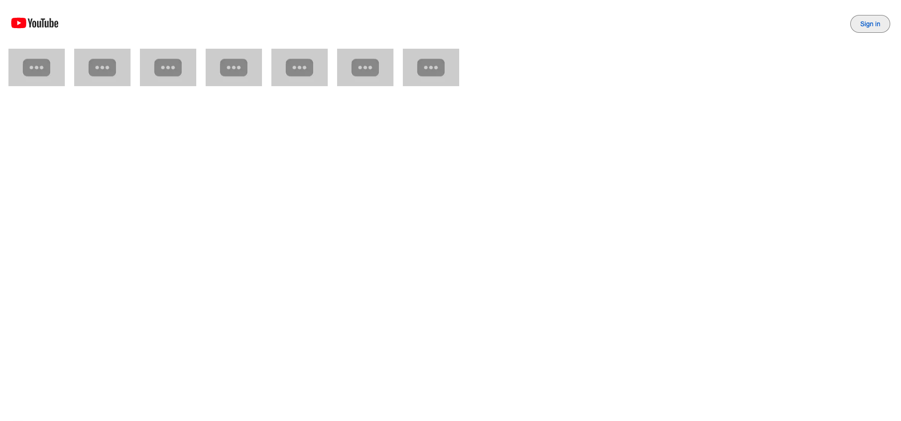
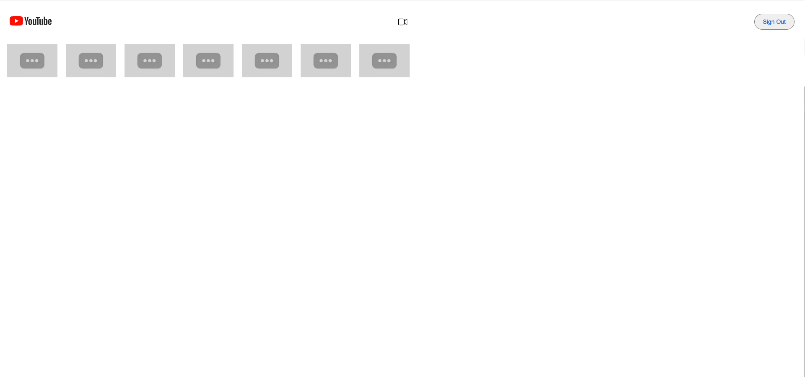
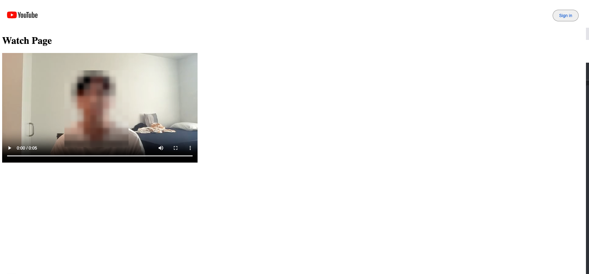
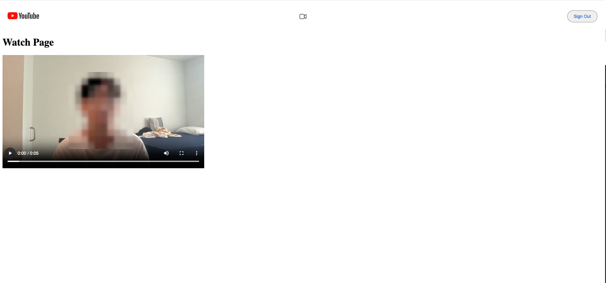

# Video Transcoder with Video Processing

This project is a **Video Transcoder** that allows users to **upload videos**, **transcode them**, and **watch the processed videos** through a Next.js web application. It leverages several cloud services to handle video uploads, processing, and metadata management.

**Note:** This public demo is under strict moderation to avoid illegal content such as inappropriate videos.

### Available Features

- 🔍 **List Videos**: Browse all uploaded videos.
- 🎥 **Watch Videos**: Watch both uploaded and transcoded videos.
- 👤 **Sign In/Out**: Secure authentication via Firebase Auth.
- ⬆️ **Upload Videos**: Upload your videos for processing.
- 🛠️ **Transcoded Videos**: Watch transcoded videos after upload.

## 📸 Screenshots

### Home Page (Logged Out)

_Browse videos without authentication_

### Home Page (Logged In)

_Upload videos and access personalized features_

### Watch Page (Logged Out)

_Watch videos as a guest user_

### Watch Page (Logged In)

## 🛠️ Tech Stack

- **Frontend**

  - [Next.js](https://nextjs.org/)
  - [TypeScript](https://www.typescriptlang.org/)

- **Backend**

  - [Express.js](https://expressjs.com/)
  - [Docker](https://www.docker.com/)
  - [FFmpeg](https://ffmpeg.org/) (for video transcoding)
  - [Firebase Functions](https://firebase.google.com/docs/functions)
  - [Google Cloud Platform](https://cloud.google.com/run)

- **Authentication**

  - [Firebase Auth](https://firebase.google.com/docs/auth)

- **Storage & Messaging**
  - [Google Cloud Storage](https://cloud.google.com/storage) (for raw and transcoded videos)
  - [Google Cloud Firestore](https://firebase.google.com/docs/firestore) (for metadata)
  - [Google Cloud Pub/Sub](https://cloud.google.com/pubsub) (for message queuing between video uploads and transcoding)

## 🏗️ Architecture

1. **Cloud Storage**: Stores raw and processed videos uploaded by users.
2. **Google Cloud Pub/Sub**: Handles messaging between the video upload and processing services.
3. **Cloud Run (Video Processing Service)**: A private service that transcodes uploaded videos using FFmpeg and then uploads the processed videos back to Cloud Storage.
4. **Cloud Firestore**: Stores video metadata (e.g., video titles, descriptions, status).
5. **Cloud Run (Next.js Web App)**: Hosts the YouTube clone web client.
6. **Firebase Functions**: Acts as the backend API, fetching and returning video metadata stored in Firestore to the web client.
